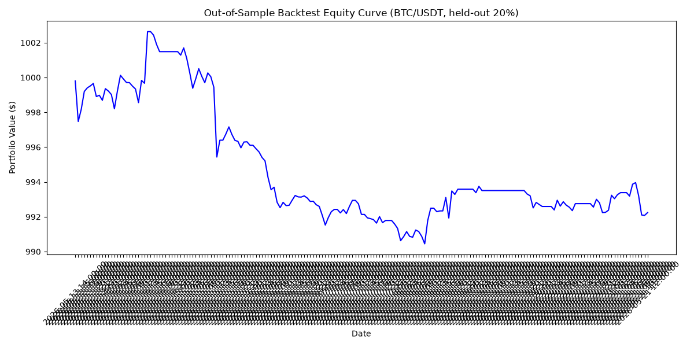

# Crypto Price Predictor

[](https://github.com/abbq14/crypto-price-predictor/actions/workflows/tests.yml)

A machine-learning pipeline that predicts short-term BTC/USDT price
direction (up/down) from technical indicators, with a backtester and a
simulated live-signal bot for validation.

> **Disclaimer:** This is an educational/research project, not financial
> advice. `live_bot.py` only prints simulated buy/sell signals over a short
> validation window and never places real orders — it connects to Binance's
> public market-data stream and uses **testnet** credentials only. Don't use
> this to trade with real funds without independent testing and risk
> management.

## Web app

An interactive [Streamlit](https://streamlit.io) dashboard wraps the model:
pick a pair and timeframe, and it fetches live Binance data, shows the
next-candle prediction with the model's confidence, and plots candlesticks
with Bollinger Bands, RSI and MACD.

```bash
streamlit run streamlit_app.py
```

> **Model scope:** the model's features include raw price levels (SMA,
> Bollinger Bands) fitted on BTC/USDT, so it is only meaningful near that
> price range. Non-BTC pairs are out-of-distribution and produce
> unreliable — often constant — predictions; the app flags this in the UI.

## How it works

1. **`src/data_pipeline.py`** — pulls historical BTC/USDT OHLCV data from
   Binance, computes technical indicators (RSI, MACD, SMA-20/50, Bollinger
   Bands), and labels each row with whether the next candle closed higher.
2. **`src/train_model.py`** — trains a `RandomForestClassifier` on those
   features to predict next-candle direction, and reports accuracy/precision/recall.
3. **`src/backtest.py`** — replays the model's predictions over the
   **held-out** portion of the dataset with a simple position-sizing/fee
   model and plots the resulting equity curve.
4. **`src/main.py`** — a CLI (`predict` command) that fetches the latest
   market data and prints the model's current direction prediction for a
   given symbol.
5. **`src/live_bot.py`** — connects to Binance's live WebSocket kline
   stream and prints simulated entries/exits (take-profit/stop-loss based
   on ATR) as new candles close, for a short validation run.

## Installation

```bash
pip install -r requirements.txt
cp .env.example .env
```

`.env` only needs Binance **testnet** credentials (from
[testnet.binance.vision](https://testnet.binance.vision)) — required by
`live_bot.py`; the other scripts only use Binance's public market data
endpoints.

## Usage

Run in order to reproduce the pipeline from scratch (a pre-trained model
and dataset are already included under `data/` and `models/`, so you can
skip straight to step 4 or 5):

```bash
python src/data_pipeline.py      # 1. pulls data -> data/historical_data.csv
python src/train_model.py        # 2. trains model -> models/trading_model.pkl
python src/backtest.py           # 3. out-of-sample backtest -> docs/equity_curve.png
python src/main.py predict --symbol BTC/USDT   # 4. one-off prediction
python src/live_bot.py           # 5. live simulated signal stream
```

## Results

The dataset is split **chronologically** (80% train / 20% test) — never
shuffled, since shuffling would let the model learn from candles that occur
after the ones it is scored on. All numbers below are on the held-out 20%
the model never saw during training.

| Metric | Model | Baseline |
| --- | --- | --- |
| Accuracy | 0.5654 | 0.5288 (always predict majority class) |
| Precision | 0.5285 | — |
| Recall | 0.7222 | — |

Backtest over the same held-out window (191 hourly candles, 20% position
sizing, 0.1% fee per side):

| | |
| --- | --- |
| Final equity | $992.24 (from $1,000) |
| ROI | **-0.78%** |
| Trades | 25 |
| Win rate | 64.00% |



### Reading these numbers honestly

The model beats the majority-class baseline by ~3.7 points of accuracy, but
that edge does **not** survive trading fees: the out-of-sample backtest ends
slightly down. A 64% win rate alongside a negative ROI is the expected
signature of many small wins and fewer, larger losses.

This is worth stating plainly because the obvious way to run this backtest
gives a very different answer. Scoring the model over the *full* dataset
reports a 95.91% win rate and +11.53% ROI — but 80% of those rows are the
model's own training data, which an unpruned RandomForest reproduces at
100% in-sample accuracy. That figure measures memorisation, not skill.
`backtest.py` therefore evaluates only the held-out slice.

## Testing

```bash
pytest tests/
```

## Project structure

```
.
├── .github/workflows/
│   └── tests.yml           # CI: pytest on Python 3.11-3.13
├── streamlit_app.py        # interactive web dashboard
├── src/
│   ├── data_pipeline.py   # fetch + feature-engineer historical data
│   ├── train_model.py     # train the RandomForest classifier
│   ├── backtest.py        # backtest the model over historical data
│   ├── main.py             # CLI for one-off predictions
│   └── live_bot.py        # live WebSocket signal simulation
├── scripts/
│   └── api_test.py         # manual Binance connectivity check
├── tests/
│   └── test_crypto.py      # unit tests for main.py / live_bot.py / backtest.py
├── data/
│   └── historical_data.csv # engineered feature dataset
├── models/
│   └── trading_model.pkl   # trained RandomForest model
├── docs/
│   └── equity_curve.png    # example backtest output
├── conftest.py
├── requirements.txt
└── .env.example
```

## License

MIT — see [LICENSE](LICENSE).
